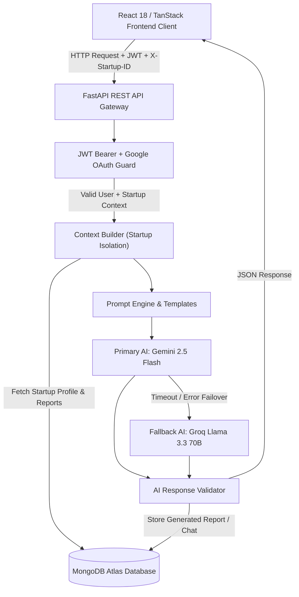
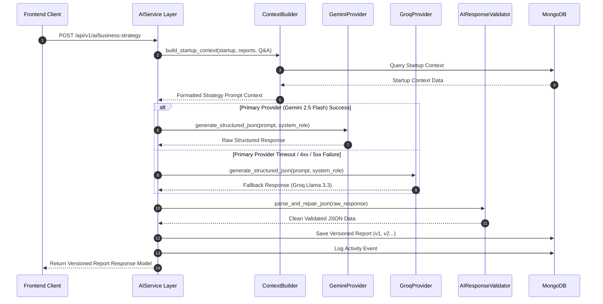
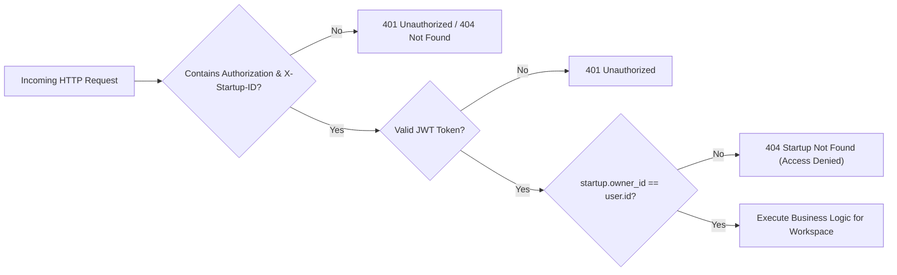

# AI Business Strategy Copilot — System Architecture (v1.0.0)

This document describes the architectural design, data flow, security model, and AI engine pipeline of **AI Business Strategy Copilot**.

---

## 1. High-Level Architecture Diagram



---

## 2. AI Generation & Failover Workflow



---

## 3. Multi-Tenant Workspace Security Architecture



---

## 4. Database Collection Schema & Relationships

```
┌─────────────────┐       ┌─────────────────┐       ┌─────────────────┐
│     Users       │1     *│    Startups     │1     *│   AI_Reports    │
├─────────────────┤───────├─────────────────┤───────├─────────────────┤
│ _id (ObjectId)  │       │ _id (ObjectId)  │       │ _id (ObjectId)  │
│ email           │       │ owner_id (Ref)  │       │ startup_id(Ref) │
│ full_name       │       │ name            │       │ report_type     │
│ role            │       │ industry        │       │ version (v1..)  │
│ preferences     │       │ stage           │       │ content (JSON)  │
└─────────────────┘       └─────────────────┘       └─────────────────┘
                                   │1
                                   │
                                   │*
                          ┌─────────────────┐
                          │  Conversations  │
                          ├─────────────────┤
                          │ _id (ObjectId)  │
                          │ startup_id(Ref) │
                          │ title           │
                          │ messages[]      │
                          └─────────────────┘
```
