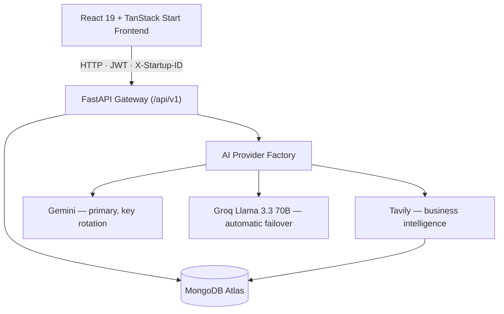
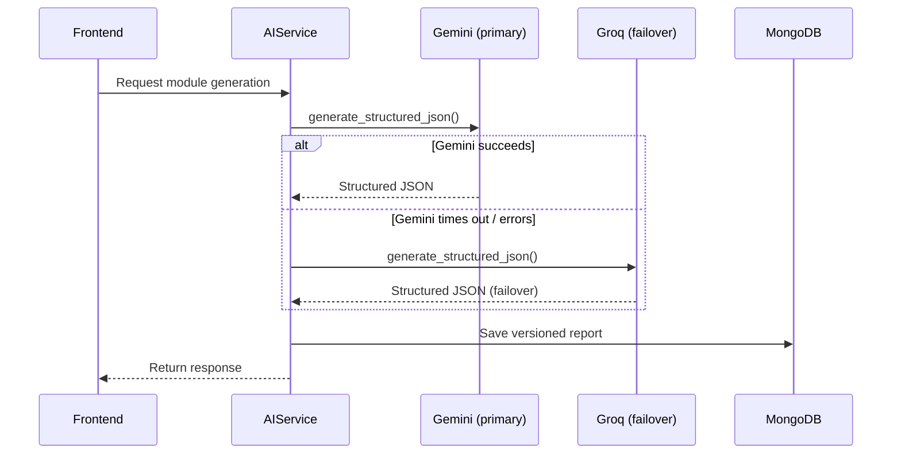
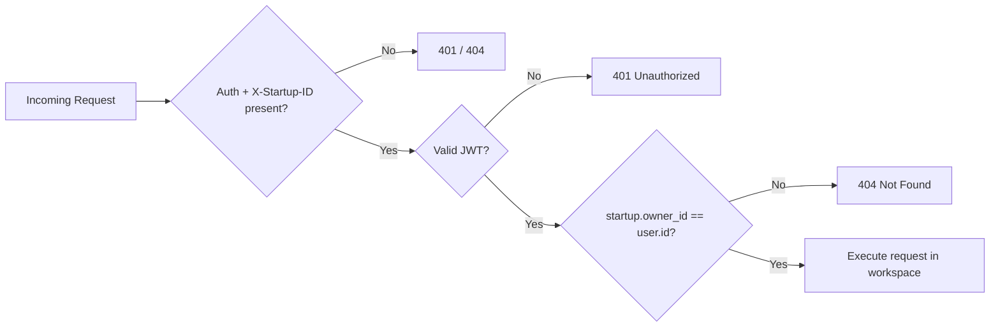

<div align="center">

<!-- 🖼 Replace with your real banner image (1280×320) before publishing -->


<br/>

# AI Business Strategy Copilot

**The AI Co-Founder that turns a raw startup idea into an investor-ready business.**

<sub>v1.0.0 · Commercial Production Release · Released August 1, 2026</sub>

<br/>

<p>


</p>

<p>


</p>

<p>
<a href="https://ai-business-strategy-copilot.vercel.app"><b>Live App</b></a> ·
<a href="https://ai-business-strategy-copilot.onrender.com/docs"><b>API Docs</b></a> ·
<a href="./ARCHITECTURE.md"><b>Architecture</b></a> ·
<a href="./FEATURES.md"><b>Feature Matrix</b></a> ·
<a href="./HACKATHON_GUIDE.md"><b>Hackathon Guide</b></a> ·
<a href="./RELEASE_NOTES.md"><b>Release Notes</b></a>
</p>

</div>

<br/>

## Table of Contents

- [Overview](#overview)
- [The Problem](#the-problem)
- [The Solution](#the-solution)
- [Demo](#demo)
- [Key Features](#key-features)
- [The 9-Module Business Journey](#the-9-module-business-journey)
- [System Architecture](#system-architecture)
- [AI Provider Pipeline](#ai-provider-pipeline)
- [Multi-Tenant Security Model](#multi-tenant-security-model)
- [Tech Stack](#tech-stack)
- [Getting Started](#getting-started)
- [Environment Variables](#environment-variables)
- [Project Structure](#project-structure)
- [API Reference](#api-reference)
- [Performance & Reliability](#performance--reliability)
- [Business Model](#business-model)
- [Roadmap](#roadmap)
- [Contributing](#contributing)
- [License](#license)
- [Contact](#contact)

<br/>

## Overview

**AI Business Strategy Copilot** is an enterprise-grade AI Business Operating System built for startup founders, venture builders, incubators, and serial entrepreneurs. It replaces scattered spreadsheets, static templates, and expensive consultants with one AI-guided **Business Journey** — from the first structured founder interview all the way to a fundraising-ready execution roadmap — backed by a dual-provider AI pipeline and live business intelligence.

Think of it as an always-on AI Chief Strategy Officer that never runs out of patience, never charges by the hour, and remembers every detail of every startup you're building.

**Built for:** Startup Founders · Entrepreneurs · Venture Builders · Incubators & Accelerators · Students · Angel Investors · VC Ecosystems

<br/>

## The Problem

| Founders struggle with | Traditional approach | Cost |
|---|---|---|
| Validating an idea | Guesswork, informal feedback | Weeks of uncertainty |
| Competitor research | Manual, scattered browser tabs | Hours per competitor |
| Business Model Canvas | Static templates, whiteboards | No iteration history |
| Financial modeling | Spreadsheets, paid consultants | $1,000s |
| Investor readiness | No clear benchmark | Missed fundraising windows |
| Execution planning | Ad-hoc to-do lists | No accountability |

Consulting services that solve this well are expensive and slow. Generic AI chat wrappers solve it poorly — they have no memory of the startup, no structured methodology, and no way to isolate one founder's data from another's.

<br/>

## The Solution

A guided, AI-native **9-module Business Journey**, where each module's output becomes context for the next — turning a single founder interview into a validated idea, a competitive strategy, a financial model, a risk assessment, an investor-readiness score, and a 30/60/90-day execution roadmap, with everything versioned and exportable.

<br/>

## Demo

<div align="center">

<!-- 🖼 Replace with a real product GIF (≈800px wide) -->


<br/><br/>

<table>
<tr>
<td align="center" width="33%"><br/><sub>Founder Command Center</sub></td>
<td align="center" width="33%"><br/><sub>Business Model Canvas</sub></td>
<td align="center" width="33%"><br/><sub>Investor Readiness Score</sub></td>
</tr>
</table>

</div>

> A full judge/demo walkthrough script (Dashboard → Journey → Reports → Copilot → Health Checks) is already written up in [`HACKATHON_GUIDE.md`](./HACKATHON_GUIDE.md).

<br/>

## Key Features

<table>
<tr><td width="26%"><b>Multi-Tenant Workspaces</b></td><td>Create and switch between multiple startups. Every request is scoped by an <code>X-Startup-ID</code> header plus JWT owner verification (<code>startup.owner_id == user.id</code>) — zero cross-tenant data leakage.</td></tr>
<tr><td><b>9-Module Business Journey</b></td><td>Interview → Idea Validation → Business Strategy → Competitor Intelligence → Business Model Canvas → Financial Planning → Risk Intelligence → Investor Readiness → Execution Roadmap.</td></tr>
<tr><td><b>Founder Command Center</b></td><td>Live scorecards — Business Health, Innovation, Financial Fitness, Risk Rating, Investor Readiness — auto-refreshing via a frontend event bus the instant an AI module finishes generating.</td></tr>
<tr><td><b>Reports Center</b></td><td>Incremental versioning (v1, v2, v3…), quick-preview modal, JSON and formatted-text export — nothing is ever overwritten.</td></tr>
<tr><td><b>AI Copilot Chat</b></td><td>A startup-scoped conversational assistant with thread pin/rename/delete and suggested-prompt shortcuts.</td></tr>
<tr><td><b>Dual AI Pipeline</b></td><td>Gemini as the primary reasoning engine (with multi-key rotation) and Groq Llama 3.3 70B as an automatic, transparent failover — unified behind a single provider factory.</td></tr>
<tr><td><b>Live Business Intelligence</b></td><td>Tavily-powered real-time market, competitor, and regulatory research feeding directly into the relevant modules.</td></tr>
<tr><td><b>Authentication</b></td><td>Email/password + Google OAuth 2.0 + JWT access and refresh tokens.</td></tr>
<tr><td><b>Observability</b></td><td>Real readiness/latency probes at <code>/health</code>, <code>/health/database</code>, <code>/health/ai</code>, and <code>/health/system</code> — not static stubs.</td></tr>
</table>

See [`FEATURES.md`](./FEATURES.md) for the complete, module-by-module feature matrix.

<br/>

## The 9-Module Business Journey

| # | Module | Core Output |
|---|---|---|
| 1 | **AI Business Interview** | Adaptive Q&A that builds the foundational business knowledge base every later module reads from |
| 2 | **Idea Validation** | Problem-solution fit score, TAM/SAM/SOM sizing, and 3 actionable validation experiments |
| 3 | **Business Strategy** | Positioning, GTM channels, pricing, and acquisition strategy |
| 4 | **Competitor Intelligence** | Direct/indirect competitor matrix, moat evaluation, counter-tactics |
| 5 | **Business Model Canvas** | Interactive, editable, versioned 9-block Lean Canvas |
| 6 | **Financial Planning** | 12-month revenue/expense forecast, break-even, runway, pricing tiers |
| 7 | **Risk Intelligence** | Financial / market / operational / regulatory / tech risk matrix with mitigation plans |
| 8 | **Investor Readiness** | 0–100 readiness score, elevator pitches, diligence checklist |
| 9 | **Execution Roadmap** | 30/60/90-day milestones, resource allocation, next-best actions |

<br/>

## System Architecture



The full architecture — including the AI generation/failover sequence diagram and the database collection schema — is documented in [`ARCHITECTURE.md`](./ARCHITECTURE.md).

<br/>

## AI Provider Pipeline

Every AI call runs through a single internal `AIProviderFactory`, so the rest of the application never talks to a specific vendor directly:



- **Multi-key Gemini rotation** absorbs rate limits without user-visible failures
- **Automatic Groq failover** keeps the product usable even during a full Gemini outage
- **AI Response Validator** repairs malformed JSON/markdown before it ever reaches the database

<br/>

## Multi-Tenant Security Model



Every founder's startups are fully isolated — reports, chats, scores, and AI context never leak across workspaces, even when one account owns a dozen startups.

<br/>

## Tech Stack

| Layer | Technology |
|---|---|
| **Frontend** | React 19, TypeScript, TanStack Start + Router, TanStack Query, Tailwind CSS 4, shadcn/ui (Radix primitives), Recharts, Sonner |
| **Backend** | Python 3.11+, FastAPI, Uvicorn, Motor (async MongoDB driver), Pydantic v2, GZip middleware |
| **Database** | MongoDB Atlas — compound indexes on `(startup_id, report_type, version)` |
| **AI** | Google Gemini (primary, multi-key rotation) · Groq Llama 3.3 70B (failover) · Tavily (business intelligence) |
| **Auth** | JWT (HS256, access + refresh) + Google OAuth 2.0 |
| **Deployment** | Frontend → Vercel · Backend → Render · Database → MongoDB Atlas |

<br/>

## Getting Started

### Prerequisites
- Python 3.11+
- Node.js 18+ (npm or bun)
- A MongoDB connection string (local or Atlas)
- API keys: Gemini, Groq, Tavily · a Google OAuth client ID/secret

### 1. Clone

```bash
git clone https://github.com/Vamshikrishna0372/AI-Business-Strategy-Copilot.git
cd AI-Business-Strategy-Copilot
```

### 2. Backend

```bash
cd backend
python -m venv venv
source venv/bin/activate        # Windows: .\venv\Scripts\Activate.ps1
pip install -r requirements.txt
cp .env.example .env            # fill in real values
uvicorn app.main:app --reload --port 8000
```

### 3. Frontend

```bash
cd startup-ai-copilot-27
npm install                     # or: bun install
npm run dev                     # or: bun run dev
```

| Service | URL |
|---|---|
| Frontend | `http://localhost:5173` |
| Backend | `http://localhost:8000` |
| API Docs | `http://localhost:8000/docs` |

> `start-dev.bat` / `start-dev.ps1` at the repo root boot both services together on Windows.

<br/>

## Environment Variables

### Backend — `backend/.env`

| Variable | Description | Required |
|---|---|:---:|
| `MONGODB_URI` | MongoDB connection string | ✅ |
| `DATABASE_NAME` | Target database name | ✅ |
| `JWT_SECRET` | Secret for signing JWTs (32+ chars) | ✅ |
| `JWT_ALGORITHM` | Default `HS256` | — |
| `JWT_EXPIRE_MINUTES` | Access token TTL | — |
| `JWT_REFRESH_EXPIRE_MINUTES` | Refresh token TTL | — |
| `GOOGLE_CLIENT_ID` / `GOOGLE_CLIENT_SECRET` | Google OAuth credentials | ✅ |
| `GEMINI_API_KEY` (+ `_1`, `_2`, `_3`) | Gemini keys used for rotation | ✅ |
| `GROQ_API_KEY` | Groq failover key | ✅ |
| `TAVILY_API_KEY` | Business intelligence search key | ✅ |
| `DEFAULT_AI_PROVIDER` / `DEFAULT_AI_MODEL` | Primary provider/model | — |
| `FALLBACK_AI_PROVIDER` / `FALLBACK_AI_MODEL` | Failover provider/model | — |
| `CORS_ORIGINS` | Allowed origins (JSON array) | ✅ |

### Frontend — `startup-ai-copilot-27/.env`

| Variable | Description |
|---|---|
| `VITE_API_BASE_URL` | Backend base URL |
| `VITE_APP_NAME` | Display name |
| `VITE_GOOGLE_CLIENT_ID` | Google OAuth client ID |

> `backend/.env.example` is the source of truth for local defaults. Never commit real secrets.
>
> **Known gap to fix:** `backend/render.yaml` currently pins production `DEFAULT_AI_MODEL` to `gemini-2.0-flash`, while the code default and this README reference Gemini 2.5 Flash — reconcile before your next deploy so the docs match what's actually running.

<br/>

## Project Structure

```
AI-Business-Strategy-Copilot/
├── backend/
│   ├── app/
│   │   ├── ai/                 # Gemini/Groq providers, factory, fallback, prompt engine
│   │   ├── api/v1/endpoints/   # auth, users, startups, modules, reports, chat, dashboard, health...
│   │   ├── auth/                # JWT + Google OAuth
│   │   ├── core/                 # config, security, logging, exceptions
│   │   ├── database/             # Motor connection + indexes
│   │   ├── dependencies/         # auth / db / config dependency injection
│   │   ├── middleware/           # CORS, GZip, logging, rate limiting
│   │   ├── models/                # Pydantic Mongo document models
│   │   ├── repositories/         # data-access layer per collection
│   │   ├── schemas/               # request/response DTOs
│   │   ├── services/              # AIService, StartupService, ProviderManager, etc.
│   │   └── main.py                 # FastAPI app factory + lifespan
│   ├── tests/                   # pytest-asyncio test suite
│   └── requirements.txt
│
├── startup-ai-copilot-27/       # TanStack Start frontend
│   ├── src/
│   │   ├── components/          # ui-kit, workspace UI, shadcn/ui primitives
│   │   ├── lib/                   # api-client, auth-context, workspace-context, event bus
│   │   ├── routes/                 # dashboard, journey, canvas, finance, risk, investor,
│   │   │                            # roadmap, reports, copilot, competitors, strategy,
│   │   │                            # validation, interview, startups, profile, settings...
│   │   └── services/               # per-domain API service modules
│   └── package.json
│
├── ARCHITECTURE.md
├── FEATURES.md
├── HACKATHON_GUIDE.md
├── RELEASE_NOTES.md
└── README.md
```

<br/>

## API Reference

Interactive documentation is live at:

- **Swagger UI** → `https://ai-business-strategy-copilot.onrender.com/docs`
- **ReDoc** → `https://ai-business-strategy-copilot.onrender.com/redoc`

All routes mount under `/api/v1` via a central router aggregator:

| Router | Responsibility |
|---|---|
| `health` | Liveness, DB ping, AI provider readiness, system metrics |
| `auth` | Register, login, Google OAuth, token refresh |
| `users` | Profile management |
| `startups` | Create/list/switch startup workspaces |
| `modules` | The 9 AI Business Journey modules |
| `reports` | Versioned report generation, retrieval, export |
| `chat` | AI Copilot conversation threads |
| `dashboard` | Business scoring & founder command center data |
| `notifications` | Notification feed |
| `settings` | User/workspace settings |
| `interviews` | Legacy stub, superseded by `modules` |

<br/>

## Performance & Reliability

- GZip response compression cuts payload size significantly on large report responses
- Compound MongoDB indexes on `(startup_id, report_type, version)` keep report queries fast at scale
- Automatic AI failover means a single provider outage never takes the product down
- Structured JSON validation repairs malformed AI output before it's persisted, so bad model output never corrupts a saved report

<br/>

## Business Model

- **Market:** 300M+ startups founded globally every year
- **Pricing:** SaaS subscription, tiered for solo founders vs. serial founders/incubators managing multiple workspaces
- **Moat:** Deep multi-tenant startup context retention plus an automated pitch/financial-modeling engine — something generic AI-chat wrappers don't replicate

Full pitch framing and investor talking points live in [`HACKATHON_GUIDE.md`](./HACKATHON_GUIDE.md).

<br/>

## Roadmap

- [x] 9-module AI Business Journey (v1.0.0)
- [x] Multi-tenant workspace isolation
- [x] Dual AI provider pipeline with automatic failover
- [x] Versioned reports center
- [x] AI Copilot chat
- [ ] Real-time WebSocket notifications (connection manager scaffolded, not yet wired in)
- [ ] Cloud file storage (current provider is a local-storage stub)
- [ ] Team collaboration / shared workspaces
- [ ] Investor-matching marketplace

<br/>

## Team

Built by a 4-person team.

<!-- 🔧 GitHub handles below are marked TBD — send them over and I'll fill them in -->

| Member | GitHub | LinkedIn |
|---|---|---|
| **Nagula Vamshikrishna** | [@Vamshikrishna0372](https://github.com/Vamshikrishna0372) | [Profile](https://www.linkedin.com/in/nagula-vamshikrishna-174b6833a/) |
| **Bhaini Ashwith Reddy** | *TBD* | [Profile](https://www.linkedin.com/in/ashwith-reddy-517781351) |
| **Mohammed Naseeruddin** | *TBD* | [Profile](https://www.linkedin.com/in/mohammed-naseeruddin-2b4933321) |
| **Ammana Sathvik Reddy** | *TBD* | [Profile](https://www.linkedin.com/in/ammana-sathvik-reddy-a00498349/) |

> Send me the GitHub handles for the *TBD* cells whenever you have them.

<br/>

## Contributing

This project is actively maintained by the team above. External contributions are welcome too:

1. Fork the repository
2. Create a feature branch — `git checkout -b feature/your-feature`
3. Commit your changes — `git commit -m "feat: add your feature"`
4. Push and open a Pull Request

Please open an issue first for larger changes so we can align before you start.

<br/>

## License

Licensed under the [MIT License](./LICENSE).

<br/>

## Contact

<div align="center">

For questions, collaboration, or demo requests, reach out to any team member above, or open an issue on this repository.

<a href="https://ai-business-strategy-copilot.vercel.app"></a>
<a href="https://github.com/Vamshikrishna0372/AI-Business-Strategy-Copilot"></a>

</div>
