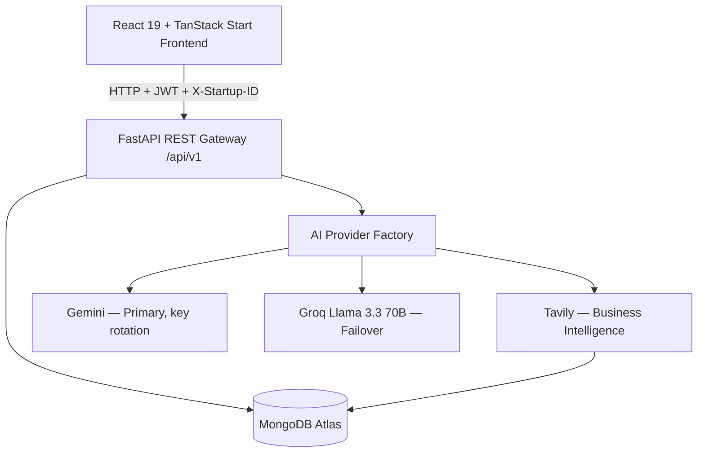
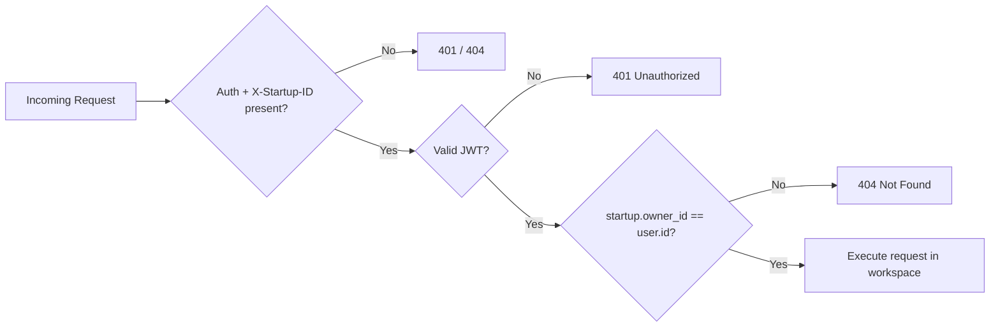

<div align="center">

<!-- Replace with a real banner (1280x320) -->


# 🚀 AI Business Strategy Copilot
### An Enterprise AI Business Operating System — from raw idea to investor-ready startup.

<sub>v1.0.0 · Commercial Production Release · Released August 1, 2026</sub>

<br/>

[](LICENSE)
[](https://fastapi.tiangolo.com/)
[](https://react.dev/)
[](https://tanstack.com/start)
[](https://www.mongodb.com/)
[](https://deepmind.google/technologies/gemini/)
[](https://groq.com/)

<br/>

**[🔴 Live App](https://ai-business-strategy-copilot.vercel.app)** &nbsp;•&nbsp; **[📖 API Docs](https://ai-business-strategy-copilot.onrender.com/docs)** &nbsp;•&nbsp; **[🏗 Architecture](./ARCHITECTURE.md)** &nbsp;•&nbsp; **[📋 Full Feature Matrix](./FEATURES.md)** &nbsp;•&nbsp; **[🏆 Hackathon Guide](./HACKATHON_GUIDE.md)**

</div>

---

## 📚 Table of Contents

- [Overview](#-overview)
- [The Problem](#-the-problem)
- [The Solution](#-the-solution)
- [Demo](#-demo)
- [Key Features](#-key-features)
- [The 9-Module Business Journey](#-the-9-module-business-journey)
- [System Architecture](#️-system-architecture)
- [Multi-Tenant Security Model](#-multi-tenant-security-model)
- [Tech Stack](#-tech-stack)
- [Getting Started](#-getting-started)
- [Environment Variables](#-environment-variables)
- [Project Structure](#-project-structure)
- [API Reference](#-api-reference)
- [Business Model](#-business-model)
- [Roadmap](#️-roadmap)
- [Contributing](#-contributing)
- [License](#-license)
- [Contact](#-contact)

---

## 🧭 Overview

**AI Business Strategy Copilot** is an enterprise AI Business Operating System for startup founders, venture builders, and serial entrepreneurs. It replaces scattered spreadsheets, static templates, and expensive consultants with a single AI-guided **Business Journey** — from the first founder interview to a fundraising-ready execution roadmap — backed by a dual-provider AI pipeline (Gemini primary, Groq automatic failover) and live business intelligence.

**Built for:** Startup Founders • Entrepreneurs • Venture Builders • Incubators & Accelerators • Students • Angel Investors & VC Ecosystems

---

## 🎯 The Problem

Founders repeatedly hit the same wall: validating an idea, understanding competitors, building a coherent strategy, modeling finances, assessing risk, and getting investor-ready — all without structured guidance, and usually paying consultants to do it.

## 💡 The Solution

A guided, AI-native **9-module Business Journey** that takes a founder's raw idea and progressively builds a validated, benchmarked, versioned, investor-ready business plan — with every module's output feeding context into the next.

---

## 🎬 Demo

<div align="center">
<!-- Replace with a real product GIF -->

</div>

> A suggested judge/demo walkthrough (Dashboard → Journey → Reports → Copilot → Health checks) is already documented in [`HACKATHON_GUIDE.md`](./HACKATHON_GUIDE.md) — link it directly rather than duplicating it here.

---

## ✨ Key Features

| Area | Highlights |
|---|---|
| **Multi-Tenant Workspaces** | Create/switch between multiple startups; every request is scoped via `X-Startup-ID` + JWT owner verification (`startup.owner_id == user.id`) — zero cross-tenant data leakage |
| **9-Module Business Journey** | Interview → Validation → Strategy → Competitor Intelligence → Business Model Canvas → Financial Planning → Risk Intelligence → Investor Readiness → Execution Roadmap |
| **Founder Command Center** | Live scorecards: Business Health, Innovation, Financial Fitness, Risk Rating, Investor Readiness — auto-refreshing via a frontend event bus whenever an AI module completes |
| **Reports Center** | Incremental versioning (v1, v2, v3…), quick-preview modal, JSON + formatted-text export |
| **AI Copilot Chat** | Startup-scoped conversational assistant with thread pin/rename/delete and suggested prompts |
| **Dual AI Pipeline** | Gemini (primary, with multi-key rotation) + Groq Llama 3.3 70B (automatic failover) behind a single `AIProviderFactory` |
| **Business Intelligence** | Tavily-powered live market/competitor/regulatory research |
| **Auth** | Email/password + Google OAuth + JWT (access + refresh tokens) |
| **Observability** | `/api/v1/health`, `/health/database`, `/health/ai`, `/health/system` — real readiness/latency probes, not static stubs |

See [`FEATURES.md`](./FEATURES.md) for the complete, module-by-module feature matrix.

---

## 🧩 The 9-Module Business Journey

| # | Module | Core Output |
|---|---|---|
| 1 | AI Business Interview | Adaptive Q&A → foundational business knowledge base |
| 2 | Idea Validation | Problem-solution fit score, TAM/SAM/SOM, validation experiments |
| 3 | Business Strategy | Positioning, GTM channels, strategic milestones |
| 4 | Competitor Intelligence | Competitive matrix, moat evaluation, counter-tactics |
| 5 | Business Model Canvas | Interactive, versioned 9-block Lean Canvas |
| 6 | Financial Planning | 12-month forecasts, break-even, runway, pricing |
| 7 | Risk Intelligence | Categorized risk matrix + mitigation protocols |
| 8 | Investor Readiness | 0–100 readiness score, elevator pitches, diligence checklist |
| 9 | Execution Roadmap | Quarterly milestones, resource allocation, action plan |

---

## 🏗️ System Architecture



The full architecture — including the AI generation/failover sequence diagram, the multi-tenant security decision flow, and the database collection schema — is documented in detail in [`ARCHITECTURE.md`](./ARCHITECTURE.md).

---

## 🔒 Multi-Tenant Security Model

Every request must carry a valid JWT **and** an `X-Startup-ID` header. The backend verifies `startup.owner_id == user.id` before executing any business logic — so a founder with five startups never sees another workspace's reports, chats, or scores, even by accident.



---

## 🛠️ Tech Stack

| Layer | Technology |
|---|---|
| **Frontend** | React 19, TypeScript, TanStack Start + Router, TanStack Query, Tailwind CSS 4, shadcn/ui (Radix primitives), Recharts, Sonner |
| **Backend** | Python 3.11+, FastAPI, Uvicorn, Motor (async MongoDB), Pydantic v2, GZip middleware |
| **Database** | MongoDB Atlas, with compound indexes on `(startup_id, report_type, version)` |
| **AI** | Google Gemini (primary, multi-key rotation) · Groq Llama 3.3 70B (failover) · Tavily (business intelligence) |
| **Auth** | JWT (HS256, access + refresh) + Google OAuth 2.0 |
| **Deployment** | Frontend → Vercel · Backend → Render · DB → MongoDB Atlas |

> The frontend was scaffolded with [Lovable](https://lovable.dev) (see `AGENTS.md`) and supports both `npm` and `bun` (`bun.lock` present).

---

## ⚡ Getting Started

### Prerequisites
- Python 3.11+
- Node.js 18+ (npm or bun)
- A MongoDB URI (local or Atlas)
- API keys: Gemini, Groq, Tavily; Google OAuth client ID/secret

### 1. Clone

```bash
git clone https://github.com/Vamshikrishna0372/AI-Business-Strategy-Copilot.git
cd AI-Business-Strategy-Copilot
```

### 2. Backend

```bash
cd backend
python -m venv venv
source venv/bin/activate        # Windows: .\venv\Scripts\Activate.ps1
pip install -r requirements.txt
cp .env.example .env            # fill in real values
uvicorn app.main:app --reload --port 8000
```

### 3. Frontend

```bash
cd startup-ai-copilot-27
npm install                     # or: bun install
npm run dev                     # or: bun run dev
```

Frontend: `http://localhost:5173` (or `:3000`) · Backend: `http://localhost:8000` · API docs: `http://localhost:8000/docs`

> `start-dev.bat` / `start-dev.ps1` at the repo root can boot both services together on Windows.

---

## 🔑 Environment Variables

### Backend (`backend/.env`)

| Variable | Description | Required |
|---|---|---|
| `MONGODB_URI` | MongoDB connection string | ✅ |
| `DATABASE_NAME` | Target database name | ✅ |
| `JWT_SECRET` | Secret for signing JWTs (32+ chars) | ✅ |
| `JWT_ALGORITHM` | Default: `HS256` | — |
| `JWT_EXPIRE_MINUTES` | Access token TTL | — |
| `JWT_REFRESH_EXPIRE_MINUTES` | Refresh token TTL | — |
| `GOOGLE_CLIENT_ID` / `GOOGLE_CLIENT_SECRET` | Google OAuth credentials | ✅ |
| `GEMINI_API_KEY` (+ `_1`, `_2`, `_3`) | Gemini keys for rotation | ✅ |
| `GROQ_API_KEY` | Groq failover key | ✅ |
| `TAVILY_API_KEY` | Business intelligence search key | ✅ |
| `DEFAULT_AI_PROVIDER` / `DEFAULT_AI_MODEL` | Primary AI provider/model | — |
| `FALLBACK_AI_PROVIDER` / `FALLBACK_AI_MODEL` | Failover provider/model | — |
| `CORS_ORIGINS` | Allowed origins (JSON array) | ✅ |

### Frontend (`startup-ai-copilot-27/.env`)

| Variable | Description |
|---|---|
| `VITE_API_BASE_URL` | Backend base URL |
| `VITE_APP_NAME` | Display name |
| `VITE_GOOGLE_CLIENT_ID` | Google OAuth client ID |

> ⚠️ `backend/.env.example` is the source of truth for defaults — never commit real secrets.
>
> ⚠️ **Heads-up:** `backend/render.yaml` currently pins `DEFAULT_AI_MODEL=gemini-2.0-flash` in production, while the code default (`config.py`) and this README's badges reference Gemini 2.5 Flash. Worth reconciling before your next deploy so the docs and the live model match.

---

## 📁 Project Structure

```
AI-Business-Strategy-Copilot/
├── backend/
│   ├── app/
│   │   ├── ai/                 # Gemini/Groq providers, factory, fallback, prompt engine
│   │   ├── api/v1/endpoints/   # auth, users, startups, modules, reports, chat, dashboard, health...
│   │   ├── auth/                # JWT + Google OAuth
│   │   ├── core/                 # config, security, logging, exceptions
│   │   ├── database/             # Motor connection + indexes
│   │   ├── dependencies/         # auth/db/config DI
│   │   ├── middleware/           # CORS, GZip, logging, rate limiting
│   │   ├── models/                # Pydantic Mongo document models
│   │   ├── repositories/         # data-access layer per collection
│   │   ├── schemas/               # request/response DTOs
│   │   ├── services/              # AIService, StartupService, ProviderManager, etc.
│   │   └── main.py                 # FastAPI app factory + lifespan
│   ├── tests/                   # pytest-asyncio test suite
│   └── requirements.txt
│
├── startup-ai-copilot-27/       # TanStack Start frontend
│   ├── src/
│   │   ├── components/          # ui-kit, workspace UI, shadcn/ui primitives
│   │   ├── lib/                   # api-client, auth-context, workspace-context, event bus
│   │   ├── routes/                 # dashboard, journey, canvas, finance, risk, investor,
│   │   │                            # roadmap, reports, copilot, competitors, strategy,
│   │   │                            # validation, interview, startups, profile, settings...
│   │   └── services/               # per-domain API service modules
│   └── package.json
│
├── ARCHITECTURE.md
├── FEATURES.md
├── HACKATHON_GUIDE.md
├── RELEASE_NOTES.md
└── README.md
```

---

## 📡 API Reference

Interactive docs are live at:
- **Swagger UI:** `https://ai-business-strategy-copilot.onrender.com/docs`
- **ReDoc:** `https://ai-business-strategy-copilot.onrender.com/redoc`

All routes are mounted under `/api/v1` via a central router aggregator (`app/api/v1/router.py`):

| Router | Responsibility |
|---|---|
| `health` | Liveness, DB ping, AI provider readiness, system metrics |
| `auth` | Register, login, Google OAuth, token refresh |
| `users` | Profile management |
| `startups` | Create/list/switch startup workspaces |
| `modules` | The 9 AI Business Journey modules |
| `reports` | Versioned report generation, retrieval, export |
| `chat` | AI Copilot conversation threads |
| `dashboard` | Business scoring & founder command center data |
| `notifications` | Real-time notification feed |
| `settings` | User/workspace settings |
| `interviews` | Legacy stub, superseded by `modules` |

---

## 💼 Business Model

- **Market:** 300M+ startups founded globally per year
- **Pricing:** Subscription SaaS — solo founders and serial founders/incubators on separate tiers
- **Moat:** Deep multi-tenant startup context retention + an automated pitch/financial-modeling engine that competitors relying on generic AI wrappers don't replicate

Full pitch framing and judge talking points: [`HACKATHON_GUIDE.md`](./HACKATHON_GUIDE.md)

---

## 🗺️ Roadmap

- [x] 9-module AI Business Journey (v1.0.0)
- [x] Multi-tenant workspace isolation
- [x] Dual AI provider pipeline with automatic failover
- [x] Versioned reports center
- [x] AI Copilot chat
- [ ] Real-time WebSocket notifications (connection manager currently scaffolded, not yet wired in)
- [ ] Cloud file storage (current provider is a local-storage stub)
- [ ] Team collaboration / shared workspaces
- [ ] Investor-matching marketplace

---

## 🤝 Contributing

1. Fork the repo
2. Create a feature branch: `git checkout -b feature/your-feature`
3. Commit: `git commit -m "feat: add your feature"`
4. Push and open a Pull Request

Please open an issue first for larger changes.

---

## 📄 License

MIT — see [`LICENSE`](./LICENSE).

---

## 📬 Contact

<div align="center">

**Krish** — Full Stack Developer (MERN • FastAPI • Spring Boot)

[](https://vamshi-portfolio-original.vercel.app)
[](https://github.com/Vamshikrishna0372)

</div>
